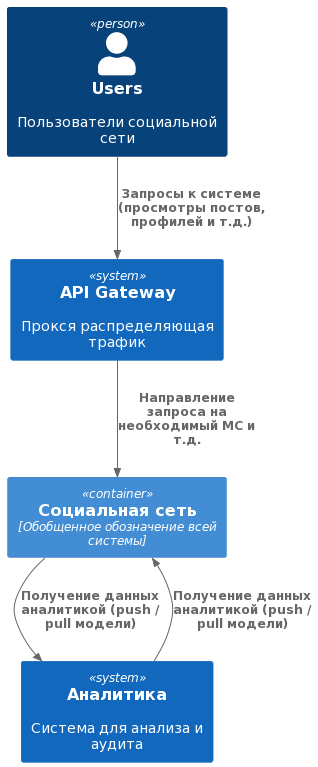

# Social Network System Design

Финальное домашнее задание по [курсу System Design](https://balun.courses/courses/system_design).

**Представим что наш заказчик хочет сделать "новую" [социальную сеть](https://www.youtube.com/watch?v=54izAMhnj0c). Пообщавшись с ним мы выяснили некоторые требования:**

### Функциональные требования:
- добавление и удаление друзей;
- просмотр друзей пользователя;
- просмотр анкеты пользователя;
- публикация поста в ленту;
- загрузка медиа файлов для постов;
- просмотр ленты постов (*домашней и пользователей)*;
- просмотр диалогов и чатов пользователя;
- отправка и чтение сообщений в диалогах и чатах.

Мы немного посидели в сети и наткнулись на интересные статьи, [например](https://vc.ru/vk/279614-auditoriya-vkontakte-2021-ezhegodnyy-rost-prodolzhaetsya). Отметили главное для себя и получили вот такие требования (конечно с учетом данных от заказчика):
### Нефункциональные требования:
- DAU 10 000 000 (допустим мы хотим стартануть MVP на Москву и область)
- Availability 99,95% (хотим сохранить всех пользователей)
- Посты и сообщения храним всегда
- На пост добавляем не более 2000 символов
- Комментарии имеют вложенность
- Максимальное количество символов сообщения также 2000
- Медиа контент до 3мб
- Т.к. в Москве каждый второй - блогер, то в среднем у нас 2 поста в неделю
- В среднем, будем считать, что наше приложение откроют и полистают 10 раз в день
- Т.к. мы классная и новая социальная сеть с киллер фичами, то в среднем пользователи будут создавать по 40 сообщений в день
- У нас много сообщений, а значит очень часто открываются чаты - 100 раз в день

## [Немного цифр](https://www.youtube.com/watch?v=LIZ1q7MdnCE&t=1s)

### Чаты и сообщения
*Первым было слово... И слово это - привет.*

RPS (write):
```
DAU = 10 000 000
40 сообщений в день
RPS = 10 000 000 * 40 / 86400 = 4 630
```

RPS (read):
```
DAU = 10 000 000
100 раз в день
RPS = 10 000 000 * 100 / 86400 = 11 574
```

Traffic (write):
```
  2000 символов для 1 сообщения
  Получаем = 4630 * 4000(2 байта на символ) = 19Mb/s
  За 5 лет, не много не мало = 4630 * 365 * 86400 = 730 058 400 000
  А в памяти так вообще = 19 * 365 * 86400 * 5 = 3 PB (многова-то, подумаем как сможем пожать и хранить старые данные)
```

### Посты
*Посчитаем сколько будуте весить наши котики и собачки...*

RPS posts (write):
```
DAU = 10 000 000
2 поста в неделю
RPS = 10 000 000 / 86400 / 3 = 38
```

RPS posts (read):
```
DAU = 10 000 000
10 раз в день
RPS = 10 000 000 * 10 / 86400 = 1157
```
Traffic (write):
```
Traffic = 38 * 4000 = 152 КБ/c
Traffic (media) = 38 * 3Мб = 114 Мб/c

Число котят и кошечек за год = 365 * 114 * 86400 = 3 955 104 000
Медиа контент займет = 3 955 104 000 * 3Мб = 11 PB
А текст поменьше... = 3 955 104 000 * 2Кб = 3 TB
```

## Переводим слова и буквы в схемы
### Архитектура представлена согласно C4 model

- С1
  
- C2
  In progress
- C3
  In progress